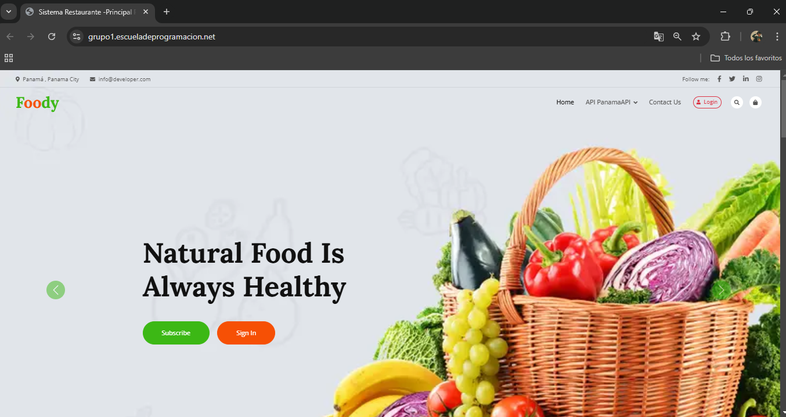

# 🍴 Restaurant Management System

Welcome to the **Restaurant Management System**, a modern platform designed to streamline restaurant operations, provide dynamic API management, and deliver real-time insights. Below is an overview of the main features and components of the system.

---

## 📊 Dashboard Overview

The **Dashboard** serves as the control center of the platform, offering:
- A quick summary of the system’s current state.
- Access to key metrics, such as the number of dishes, suppliers, and user interactions.
- Shortcuts to navigate through the system’s core functionalities.

  
*The main dashboard showcasing key metrics and navigation.*

---

## 🌍 API Management: Panama Localization

The platform features a powerful **API Management** system specifically designed to handle location-based data in Panama. This API includes endpoints for managing:
- **Districts**: Fetch all districts or get details for a specific district.
- **Provinces**: Access province information across Panama.
- **Corregimientos**: Manage detailed corregimiento data for granular localization.

Example endpoints include:
```bash
GET /api/districts
GET /api/provinces/{id}
GET /api/corregimientos/{id}
```

This API is designed to be flexible, secure, and ready for production deployment.

  
*An example of the API management interface, showing all endpoints.*
---
## 📜 API Documentation

The system includes a **real-time API Documentation Panel**, accessible directly from the dashboard. This panel allows users to:
- **Explore Endpoints**: View and test all available API routes interactively.
- **Authentication Control**: Test secured endpoints with admin-provided tokens.
- **Live Updates**: Automatically reflect the latest changes made to the API, ensuring the documentation is always up-to-date.

Access the documentation by navigating to `/api/documentation`.

---

## 🍽️ Dishes Panel

The **Dishes Panel** offers a comprehensive breakdown of all dishes served at the restaurant. Key features include:
- Add, edit, or delete dishes with ease.
- View detailed information about each dish, including ingredients, preparation time, and pricing.
- Manage dish categories for better organization and faster user navigation.

  
*The Dishes Management Panel, allowing full control over the menu.*

---

## ⭐ Top Rated Dishes

The **Top 5 Best Rated Dishes** feature dynamically showcases the most highly-rated dishes based on user reviews. It updates in real time as new ratings are submitted, ensuring:
- Users can always see the most popular dishes.
- Restaurant owners can identify which dishes are performing best.

This feature is prominently displayed on the dashboard for quick insights.

  
*Real-time updates showing the 5 top-rated dishes.*

---

## 💬 Customer Testimonials

The **Testimonials Section** highlights the most recent feedback from customers. It includes:
- Real-time updates with the latest comments and reviews.
- A dedicated space for customers to share their thoughts about the restaurant.
- Insightful data to help the restaurant improve its service quality based on user feedback. 

  
*Customer testimonials showcasing the most recent reviews.*

---

# 🍽️ **Dish Ratings & Reviews Feature**  

Welcome to the **Dish Ratings & Reviews** feature! This functionality allows users to leave their thoughts and ratings on dishes, fostering a vibrant community of food lovers. Whether a dish was spectacular or could use some improvement, your users can share their experiences and guide others.  

  

---

## 🚀 **Key Features**  

### ⭐ **Rate Your Favorite Dishes**
- Users can rate dishes on a scale of 1 to 5 stars.
- Clear visual representation of the average rating.  


---

### ✍️ **Leave Detailed Reviews**
- Share your experience in a comment box.  
- Reviews can include:  
  - What you loved  
  - Suggestions for improvement  
  - Personal tips (e.g., "Try this dish with extra sauce!")  

---

### 🔍 **Explore Reviews Easily**
- Browse reviews by most helpful, newest, or highest-rated.  
- Filter comments based on rating (e.g., show only 5-star reviews).  

---


## 🚀 Get Started

Follow these steps to set up the project locally:

```bash
# Step 1: Clone the repository
git clone https://github.com/brayanalmengor04/restaurant-menu-web.git
cd restaurant-menu-web.git

# Step 2: Install dependencies
composer install
npm install

# Step 3: Set up the environment
cp .env.example .env
# Update database credentials and API configurations in the .env file

# Step 4: Run database migrations
php artisan migrate

# Step 5: Start the development server
php artisan serve
```

---

## ✨ Future Features

We plan to enhance the platform with the following features:
1. **Advanced Analytics**: Generate in-depth reports on dish performance, supplier reliability, and user activity.
2. **Mobile Optimization**: A fully responsive design for mobile and tablet users.
3. **Localization**: Support for multiple languages to cater to a global audience.

---

## 📧 Contact

For any questions, suggestions, or support, feel free to contact us:
- **Email**: [support@restaurant-management.com](mailto:support@restaurant-management.com)
- **GitHub Issues**: [Submit Issues](https://github.com/your-username/restaurant-management-system/issues)

---
```
